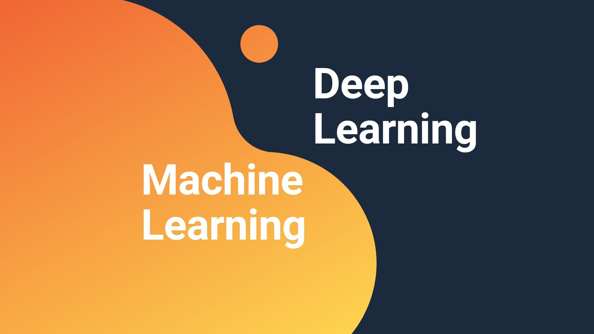

# Journey of Machine Learning and Deep Learning

**Day1 of MachineLearningDeepLearning**
- **Natural Language Processing:** It is a subfield of linguistics, computer science, and artificial intelligence concerned with interactions between computers and human language, in particulars how to program computers to process and analyze large amount of natural language data. In my journey of MachineLearning DeepLearning, I am brushing up on my skills of NLP. Today I got an overview of different text preprocessing processes such as Tokenization, Stopword removal, Stemming, Lemmatization and I implemented a few of them. I hope you will gain some insights and hope you will also spend time learning the topics. Excited about the days ahead ! 

**Day2 of MachineLearningDeepLearning**
- **Text Preprocessing:** It is a crucial step that involves cleaning and transforming raw text data into a format that can be easily analyzed and understood by machine learning models. Today I have learned more about preprocessing steps like One Hot Encoding (OHE), Bag of Words, N-grams and implemented them in code. Here, I have shared the notes about text representation techniques in the snapshot and hope you will also spend time learning the topics. Excited about the days ahead ! 

**Day3 of MachineLearningDeepLearning**
- **Text Representation:** It is the process of converting raw text data into structured format that can be analyzed and processed by machine learning algorithms and goal is to capture meaning and structure of text data in a way that enables the ML algorithm to make accurate predictions or classifications. Today I learned about preprocessing steps, One Hot Encoding (OHE), TF–IDF, Word Embedding,Word2Vec, CBOW, skip grams, also implemented them in code. And explored Gensim library. Here, I have shared the notes about text representation techniques in the snapshot and hope you will also spend time learning the topics. Excited about the days ahead ! 

**Day4 of MachineLearningDeepLearning** 
- **Part of Speech Tagging:** POS Tagging is the process of assigning grammatical information to words in a sentence, such as nouns, verbs, adjectives, adverbs, pronoun, prepositions, conjunction, and interjection. Its purpose is to analyze the text to understand the meaning of words and the relationships between them in given sentences or texts. Today I learned POS Tagging, Emission Probability, Transition Probability, Hidden Markov Models, Viterbi Algorithm and revised the previous topics which I have covered. I hope you will gain some insights and hope you will also spend time learning the topics. Excited about the days ahead ! 

**Day5 of MachineLearningDeepLearning**
- **Recurrent Neural Network:** A recurrent neural network (RNN) is a type of artificial neural network that is designed to process sequential data, where the current input depends not only on the current time step but also on the previous inputs. RNNs can be used for a variety of tasks, including language modeling, speech recognition, and image captioning. Today I learned about types of RNN, Forward and Backward Propagation in RNN, LSTM RNN, and its architecture, and a few more topics. I hope you will gain some insights and hope you will also spend time learning the topics. Excited about the days ahead! 

**Day6 of MachineLearningDeepLearning**
- **Sequence to Sequence Learning:** A Seq2Seq is a type of neural network architecture used for tasks involving sequential data like machine translation, text summarization, etc. The major components of Seq2Seq are: Encoder and Decoder. Today I learned about Seq2Seq Learning, Encoder, Decoder, Problems with encoder & decoder, as well as it's solution. Also today I read two research paper. I hope you will gain some insights and hope you will also spend time learning the topics. Excited about the days ahead! 
- Paper:
  - [Sequence to Sequence Learning with Neural Networks](https://proceedings.neurips.cc/paper/2014/file/a14ac55a4f27472c5d894ec1c3c743d2-Paper.pdf)
  - [NEURAL MACHINE TRANSLATION BY JOINTLY LEARNING TO ALIGN AND TRANSLATE](https://arxiv.org/pdf/1409.0473.pdf)

.png)
.png)

**Day7 of MachineLearningDeepLearning**
- Attention is all you need" is a newer approach that has shown promising results in machine translation and other natural language processing tasks. It relies solely on self-attention mechanisms and does not use any recurrent or convolutional neural networks. This approach has several advantages, such as improved parallelism and reduced computation time, and has achieved state-of-the-art results on several benchmarks. Today, I acquired knowledge on Encoder, Decoder, Seq2Seq Learning, self-attention, embedding layer, and positional encoding. Additionally, I read the paper "Attention is All You Need", although I struggled to comprehend most of it, I gained a theoretical understanding of its content. I am planning to apply this acquired knowledge in coding tomorrow. Excited about the days ahead!
- Reference:
  - [The Illustrated Transformers](https://jalammar.github.io/illustrated-transformer/)

